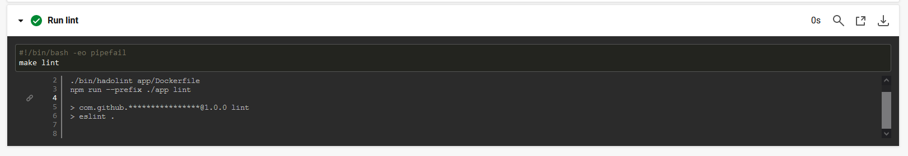
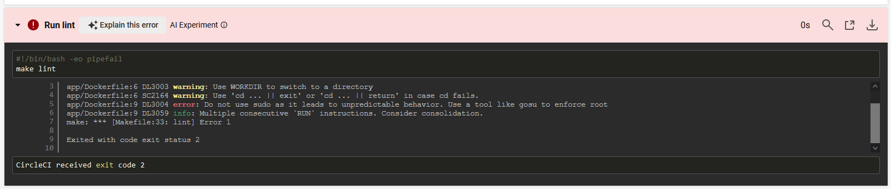
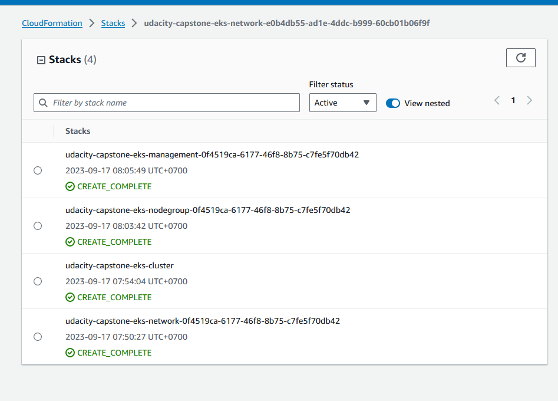
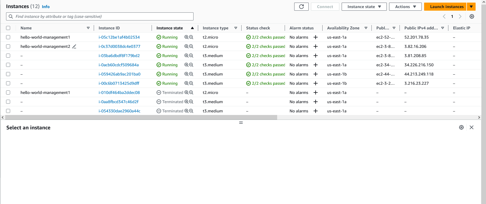
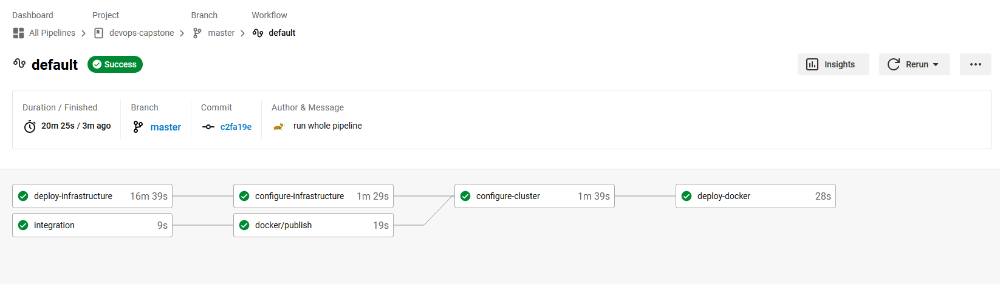
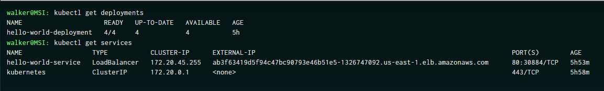
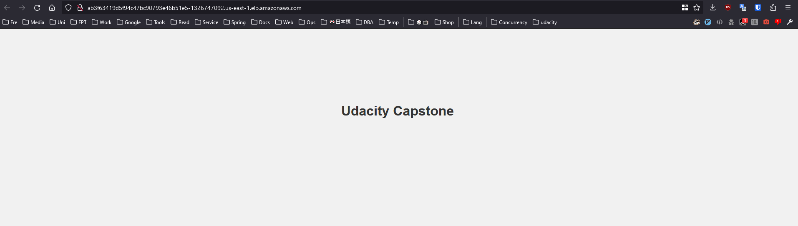

# DevOps Engineer Capstone Project

Capstone project of the Cloud DevOps Engineer Nanodegree at Udacity,
showcasing the use of several CI/CD tools and cloud services covered in the program [Udacity - AWS Cloud DevOps Engineer](https://learn.udacity.com/nanodegrees/nd9991).

## Introduction

This project deploy a simple Node express application using CircleCI and a Kubernetes (K8S) cluster deployed in AWS EKS:

- Building CircleCI pipelines to implement Continuous Integration and Continuous Deployment
- Using AWS, Ansible and CloudFormation to deploy clusters
- Building Kubernetes clusters
- Building Docker containers in pipelines

## Project

The project build a Docker image and then run it in a Kubernetes cluster.

The project includes the following main tasks:

- Test the project's code using linting:  `make lint`
  + Lints shell scripts, Dockerfile and Javascript code
- Create a Dockerfile to containerize the Nodejs application: [Dockerfile](app/Dockerfile)
- Deploy to a public Docker Registry:
  + The containerized application: [hello-world](https://hub.docker.com/repository/docker/walterclementsjr/hello-world)
- Deploy a Kubernetes cluster
- config cluster using Ansible

The CircleCI pipeline([config.yml](.circleci/config.yml)) will execute:

- Code lint
- Build and publish the Docker container image
- Deploy K8s and management stacks
- Deploy newest Docker Image

### Linting

Linting is used to check if the Application and Dockerfile is syntactically correct, making sure that the code quality is high.
This project uses ESLint and Hadolint.

- output when lint passes:
  
- output when lint fails:
  

### List of deployed Stacks

### List of deployed Instances

### CircleCi Pipelines

Run a CircleCi Pipeline to test and deploy changes to the Cluster using Ansible.

Pipeline workflow: 

### Access the Application

Check the deployments after the EKS Cluster has been successfully configured using Ansible within the CI/CD Pipeline
using `kubectl`: 

Access the app using Public LB DNS: http://ab3f63419d5f94c47bc90793e46b51e5-1326747092.us-east-1.elb.amazonaws.com/

## Tools and Services used

- [Circle CI](https://www.circleci.com): CI/CD service
- [Amazon AWS](https://aws.amazon.com/): Cloud services
- [AWS EKS](https://aws.amazon.com/eks/): Amazon Elastic Kubernetes Service
- [AWS eksctl](https://eksctl.io): CLI for Amazon EKS
- [AWS CLI](https://aws.amazon.com/cli/): CLI for AWS
- [CloudFormation](https://aws.amazon.com/cloudformation/): AWS Infrastructure as Code tool
- [kubectl](https://kubernetes.io/docs/reference/kubectl/): a CLI tool to control Kubernetes clusters
- [Docker Hub](https://hub.docker.com/): docker image repository service

## Notes

### Setup

The project uses:

- [circleci/docker](https://circleci.com/developer/orbs/orb/circleci/docker) orb to `build` and `publish` images.
  + DOCKER_LOGIN
  + DOCKER_PASSWORD

- [circleci/aws-cli](https://circleci.com/developer/orbs/orb/circleci/aws-cli) to deploy AWS stacks.
  + AWS_ACCESS_KEY_ID
  + AWS_SECRET_ACCESS_KEY
  + AWS_DEFAULT_REGION

- a [kvdb](https://kvdb.io/) bucket

### Main Files

- [Makefile](./Makefile): the main file to execute install and linting steps
- [config.yml](.circleci/config.yml): run CI and CD
- [index.js](./app/index.js): the Nodejs application
- [Dockerfile](./app/Dockerfile): the Docker image's specification file
